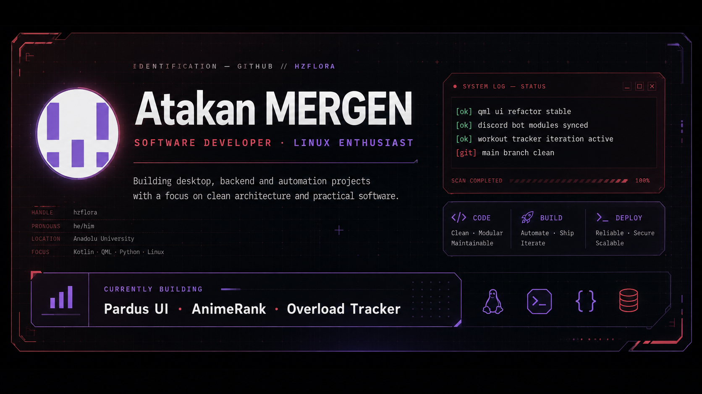
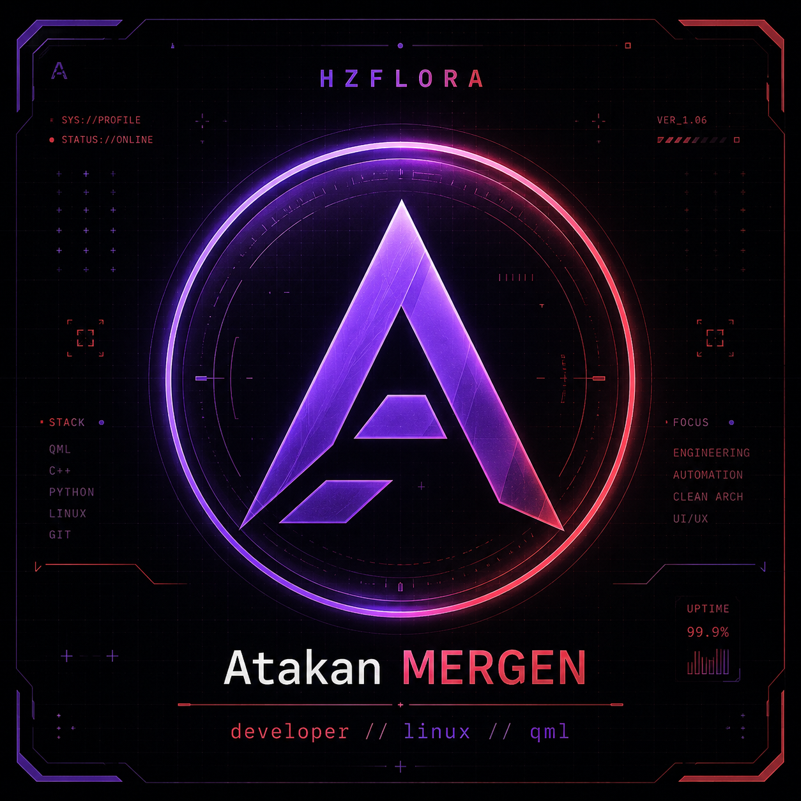
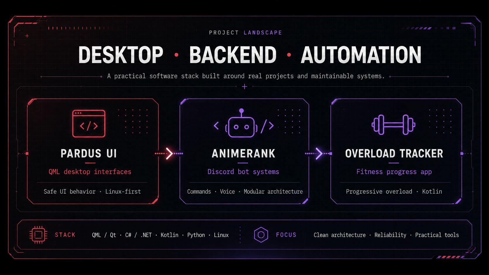

<div align="center">



<br />

[](https://github.com/hzflora)
[](https://github.com/hzflora?tab=followers)
[](https://github.com/hzflora?tab=repositories)

</div>

---

<table>
<tr>
<td width="68%" valign="top">

## `whoami`

I'm **Atakan MERGEN**, a software developer and Anadolu University student based in Türkiye.

I build practical software across desktop applications, backend systems and automation. My current work focuses on **QML/Qt interfaces**, **C#/.NET services and Discord bots**, **Kotlin applications**, Linux deployments and maintainable software architecture.

I enjoy taking projects beyond the prototype stage: testing them on real hardware, investigating platform-level problems and refining the architecture until the system becomes reliable.

```yaml
name: Atakan MERGEN
handle: hzflora
location: Türkiye
education: Anadolu University
focus:
  - Desktop application development
  - Backend systems
  - Automation and developer tooling
  - Linux and open-source software
principles:
  - Clean architecture
  - Maintainability
  - Reliability
  - Practical user experience
```

</td>
<td width="32%" align="center" valign="top">



</td>
</tr>
</table>

## `current_status`

```text
[ok]  QML desktop interface development
[ok]  Discord bot architecture and voice features
[ok]  Progressive overload tracking application
[run] Linux deployment, hardware testing and debugging
[git] Learning by building and shipping real projects
```

## `project_landscape`



### Pardus UI

A Linux-first desktop interface project built with **Qt Quick and QML**. The project focuses on safe UI behavior, maintainable component boundaries and compatibility with real-world classroom hardware.

Recent work includes:

- Refactoring UI flows without breaking existing behavior
- Testing desktop startup and application launching on interactive boards
- Diagnosing touchscreen, kernel header and package repository problems
- Improving fault handling and deployment reliability

[](https://github.com/twncer/pardus)

### AnimeRank

A modular Discord bot developed with **C#**, **.NET** and **Discord.Net**.

The project includes command dispatching, voice-channel interactions, structured logging and feature-oriented code organization. Current development focuses on strengthening connection handling and reducing coupling between Discord-specific infrastructure and application logic.

```text
Prefix Commands → Dispatcher → Feature Handler
                              ↘ Logging / Error Handling
Voice Request   → Audio Connection → Discord Gateway
```

### Overload Tracker

A Kotlin application designed to track progressive overload and workout development.

The project aims to make training progress easier to understand by organizing exercise history, workload changes and long-term progression in a clear interface.

### Restaurant Data

A Python project for collecting, transforming and working with restaurant-related datasets.

The project represents my interest in data processing, automation and building small tools around practical datasets.

## `technology_stack`

<div align="center">

### Languages


### Platforms and tools


</div>

## `engineering_interests`

<table>
<tr>
<td width="50%" valign="top">

### Desktop systems

- QML component architecture
- State management and safe navigation
- Touchscreen-oriented interfaces
- Linux desktop integration
- Hardware-level testing

</td>
<td width="50%" valign="top">

### Backend and automation

- Modular C# applications
- Discord bot infrastructure
- Async operations and error handling
- Python data tooling
- Logging and operational visibility

</td>
</tr>
<tr>
<td width="50%" valign="top">

### Software quality

- Refactoring legacy code safely
- Explicit module boundaries
- Testable business logic
- Useful diagnostics
- Predictable failure behavior

</td>
<td width="50%" valign="top">

### Linux and deployment

- Debian-based environments
- Package and certificate troubleshooting
- Kernel and device compatibility
- Input device diagnostics
- Real-device validation

</td>
</tr>
</table>

## `github_metrics`

<div align="center">


<br />


<br />


</div>

## `development_principles`

```csharp
public sealed class DevelopmentPrinciples
{
    public bool PreferClearArchitecture { get; } = true;
    public bool TestOnRealSystems { get; } = true;
    public bool LogUsefulFailures { get; } = true;
    public bool ShipWorkingSoftware { get; } = true;
}
```

I prefer systems that are understandable under failure, not only when everything works. A useful error message, a clean module boundary and a repeatable test procedure are part of the product—not afterthoughts.

## `learning_queue`

```text
01. Deeper Qt Quick and QML architecture
02. Reliable asynchronous and voice workflows in .NET
03. Linux device, input and deployment internals
04. Testing strategies for UI-heavy applications
05. Better observability for small production systems
```

## `contact`

<div align="center">

[](https://github.com/hzflora)
[](YOUR_LINKEDIN_URL)
[](mailto:YOUR_EMAIL_ADDRESS)

<br />

```text
BUILD → TEST → BREAK → DEBUG → IMPROVE → SHIP
```

</div>
