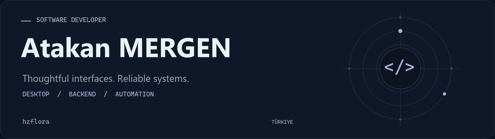
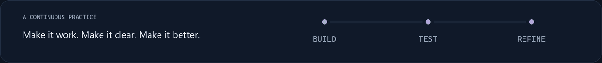

 

<a href="https://github.com/hzflora">GitHub</a> &nbsp;·&nbsp;
<a href="https://www.linkedin.com/in/atakan-mergen-32222a360">LinkedIn</a> &nbsp;·&nbsp;
<a href="mailto:mergenatakan@gmail.com">Email</a>

## A little about me

I'm **Atakan MERGEN**, a software developer and **Anadolu University** student based in Türkiye.

I also took part in the **42 Kocaeli Piscine**, building my foundations in **C programming**, **Unix shell** and hands-on problem solving.

I build desktop applications, backend systems and tools that make everyday work easier. My interests sit where **thoughtful interfaces**, **clear architecture** and **reliable software** meet.

I enjoy the work that comes after the first prototype: testing on real hardware, understanding unexpected behavior and turning an idea into something people can use.

## Selected work

### [42 Piscine · 42 Kocaeli ↗](https://github.com/hzflora/42-piscine)

Projects and exercises from my Piscine experience at **42 Kocaeli**. This collection follows my work with **C**, from pointers and string manipulation to recursion and memory allocation, alongside **Unix shell** exercises and the **Rush01** project.

**Inside the repository:** [C00–C07](https://github.com/hzflora/42-piscine) · [Shell00](https://github.com/hzflora/42-piscine/tree/master/Shell00) · [Rush01](https://github.com/hzflora/42-piscine/tree/master/Rush01)

### [Pardus UI ↗](https://github.com/twncer/pardus)

Linux desktop interfaces built with **Qt Quick and QML**. My work includes component refactoring, touchscreen interactions and deployment on classroom hardware.

### AnimeRank

A modular Discord bot built with **C#**, **.NET** and **Discord.Net**. Exploring command handling, voice interactions and clean boundaries between features and infrastructure.

### [Overload Tracker ↗](https://github.com/hzflora/overloadtracker)

A **Kotlin** application for tracking progressive overload and workout development, with a focus on making training progress easier to follow.

### [Restaurant Data ↗](https://github.com/hzflora/restaurantdata)

**Python** tools for collecting and transforming restaurant-related datasets. A practical space for exploring data processing and automation.

## My toolbox

| Area | Technologies |
| :--- | :--- |
| Programming foundations | C · Unix shell |
| Desktop & interfaces | Qt · QML · C++ |
| Backend & bots | C# · .NET · Discord.Net |
| Applications & data | Kotlin · Java · Python |
| Web | JavaScript · SCSS · Ruby |
| Everyday tools | Linux · Debian · Pardus · Git · GitHub |

## Currently exploring

- Better component architecture and state management in Qt Quick.
- Reliable asynchronous workflows and voice features in .NET.
- Linux deployment, input devices and testing on real systems.

## How I build

Clear boundaries, useful diagnostics and repeatable testing matter to me. I aim to make software easy to understand, improve and trust—even when something goes wrong.

 

Always learning. Always building.

